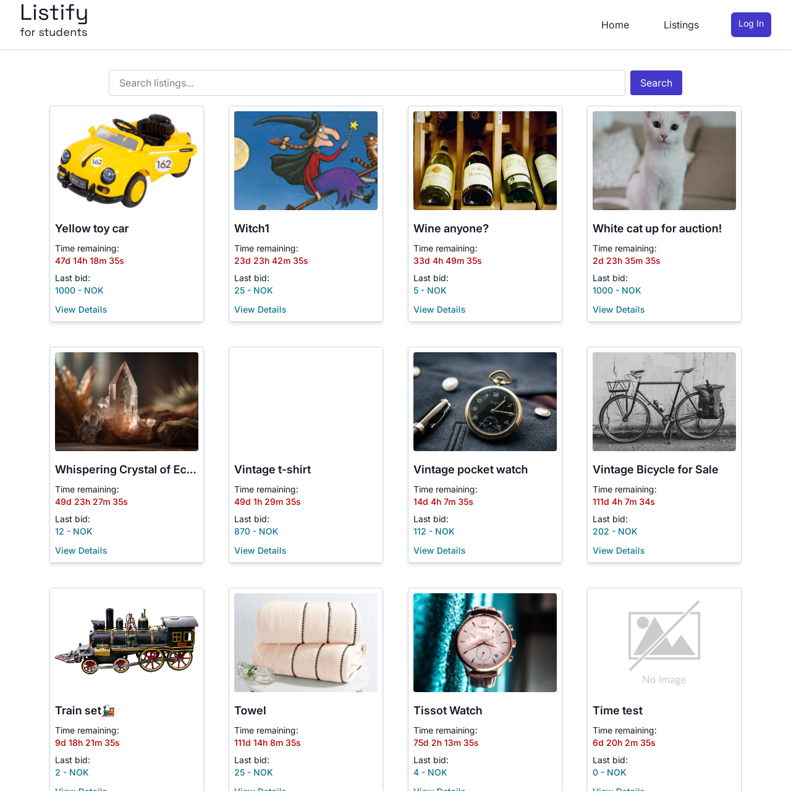

# Listify - Student Marketplace Auction Platform


## Overview

Listify is a specialized auction platform designed exclusively for students. It allows users to create listings, place bids, and connect with other students through a secure, user-friendly interface.

## Live Demo

🌐 [View Live Demo](https://listifyv3.netlify.app/)

## Features

- **User Authentication**: Secure login/registration system with JWT authentication
- **Listing Management**: Create, edit, and delete auction listings
- **Bidding System**: Place bids on active listings
- **Profile Management**: Customize user profiles with images and information
- **Responsive Design**: Fully responsive interface that works on all devices
- **Search Functionality**: Find listings by keywords
- **Secure API Integration**: Protected API endpoints via Netlify functions

## Screenshots

<table>
  <tr>
    <td></td>
    <td></td>
  </tr>
  <tr>
    <td></td>
    <td></td>
  </tr>
</table>

## Tech Stack

- **Frontend**: HTML, CSS, JavaScript (Vanilla)
- **CSS Framework**: Tailwind CSS
- **Build Tool**: Vite
- **Deployment**: Netlify
- **API Integration**: Netlify Functions
- **Authentication**: JWT

## Getting Started

### Prerequisites

- Node.js (v18 or higher)
- npm or yarn

### Installation

1. Clone the repository
   ```bash
   git clone https://github.com/AndrewMoisa/ListifyV2
   cd listify
   ```
2. Install dependencies
   ```bash
   npm install
   # or
   yarn install
   ```
3. Set up environment variables
   - Create a `.env` file in the root directory
   - Add your configuration (refer to `.env.example`)
4. For local development with Netlify Functions:

   - Install Netlify CLI globally
   - npm install -g netlify-cli

   Start the Netlify dev environment (includes functions)

   - netlify dev

5. For production deployment:

Connect your GitHub repository to Netlify
Configure environment variables in Netlify dashboard:
Go to Site settings > Environment variables
Add API_KEY and BASE_URL variables
Set build command to npm run build
Set publish directory to dist
Add a netlify.toml file to your project

```toml
[build]
publish = "dist"
command = "npm run build"
functions = "netlify/functions"

[dev]
framework = "vite"

[[redirects]]
from = "/*"
to = "/index.html"
status = 200
```

6. Open your browser and visit http://localhost:5173 for Vite dev server or http://localhost:8888 for Netlify dev

## Contributing

We welcome contributions from everyone! Please follow these steps:

1. Fork the repository
2. Create a new branch (`git checkout -b feature/YourFeature`)
3. Make your changes
4. Commit your changes (`git commit -m 'Add some feature'`)
5. Push to the branch (`git push origin feature/YourFeature`)
6. Open a pull request

Please ensure your code adheres to our coding standards and is well-tested.

## License

This project is licensed under the MIT License - see the [LICENSE](LICENSE) file for details.

---
